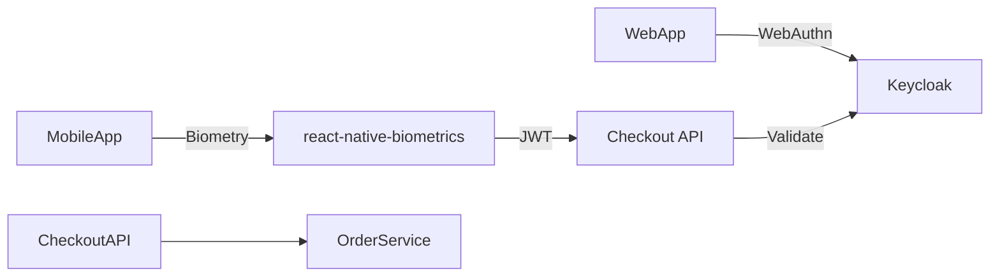

# Universal Biometric Auth – Architekturdiagramm

```mermaid
flowchart LR
  WebApp -->|WebAuthn| AuthService[Keycloak]
  MobileApp -->|Biometry| RNModule[react-native-biometrics]
  RNModule -->|JWT| Backend[Checkout API]
  Backend -->|Validate| AuthService
  CheckoutAPI --> OrderService
```
