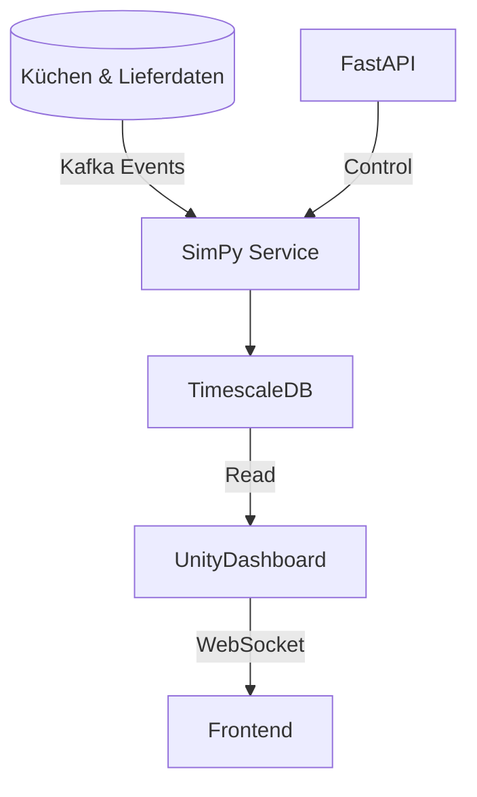

# Digital Twin – Architekturdiagramm

```mermaid
flowchart TB
  RealityData[(Küchen & Lieferdaten)]
  RealityData -->|Kafka Events| SimConsumer
  SimConsumer[SimPy Service] --> SimDB[TimescaleDB]
  SimDB -->|Read| UnityDashboard
  FastAPI -->|Control| SimConsumer
  UnityDashboard -->|WebSocket| Frontend
```
