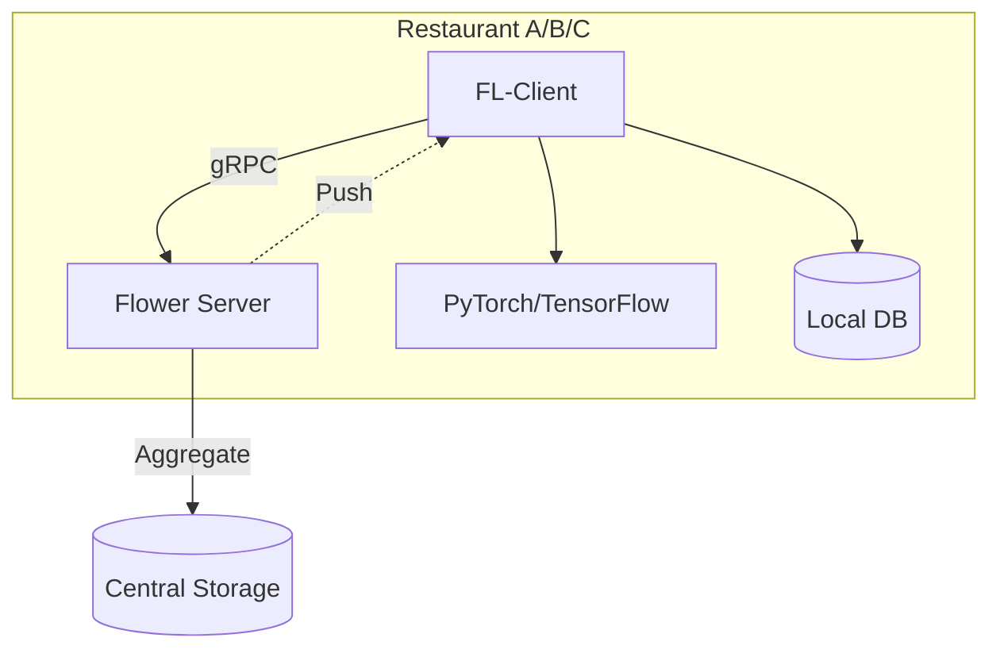

# Federated Learning – Architekturdiagramm

```mermaid
flowchart TB
  subgraph Restaurant A/B/C
    LocalClient[FL-Client] -->|gRPC| FLServer[Flower Server]
    LocalClient --> LocalModel[PyTorch/TensorFlow]
    LocalClient --> LocalData[(Local DB)]
  end
  FLServer -->|Aggregate| GlobalModel[(Central Storage)]
  FLServer -.->|Push| LocalClient
```
