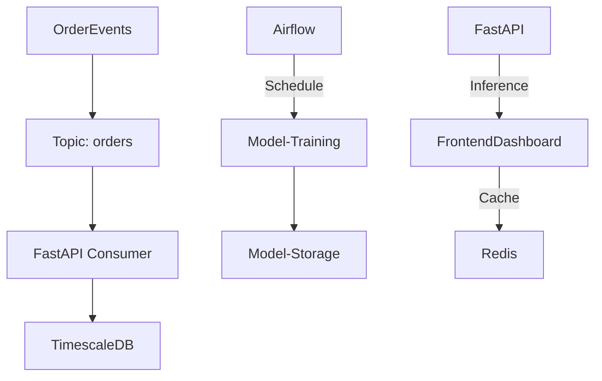

# Predictive Supply Forecasting – Architekturdiagramm

```mermaid
flowchart TB
  OrderEvents --> Kafka[Topic: orders]
  Kafka --> ForecastConsumer[FastAPI Consumer]
  ForecastConsumer --> TimescaleDB
  Airflow -->|Schedule| TrainingJob[Model-Training]
  TrainingJob --> S3[Model-Storage]
  FastAPI -->|Inference| FrontendDashboard
  FrontendDashboard -->|Cache| Redis
```
