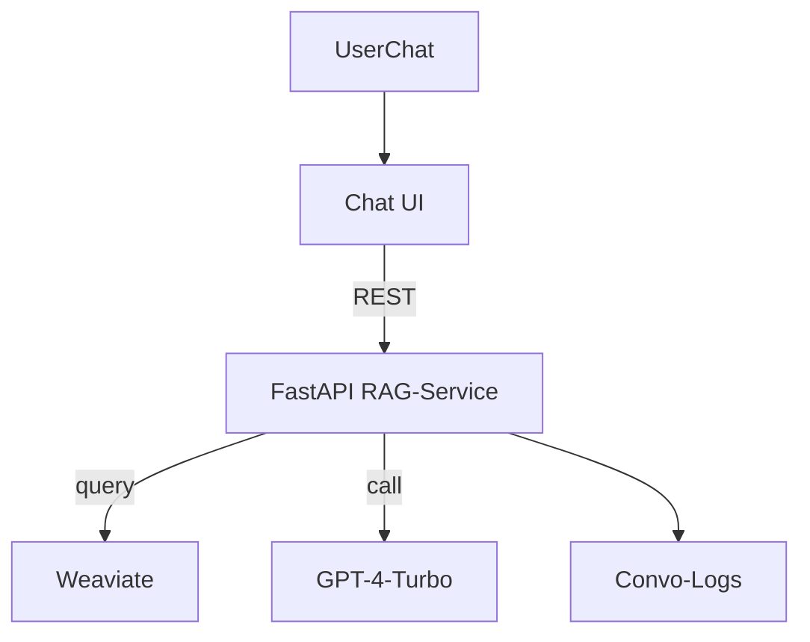

# Conversational AI Help Center – Architekturdiagramm

```mermaid
flowchart TB
  UserChat --> ReactClient[Chat UI]
  ReactClient -->|REST| API[FastAPI RAG-Service]
  API -->|query| Weaviate
  API -->|call| OpenAI[GPT-4-Turbo]
  API --> PostgreSQL[Convo-Logs]
```
