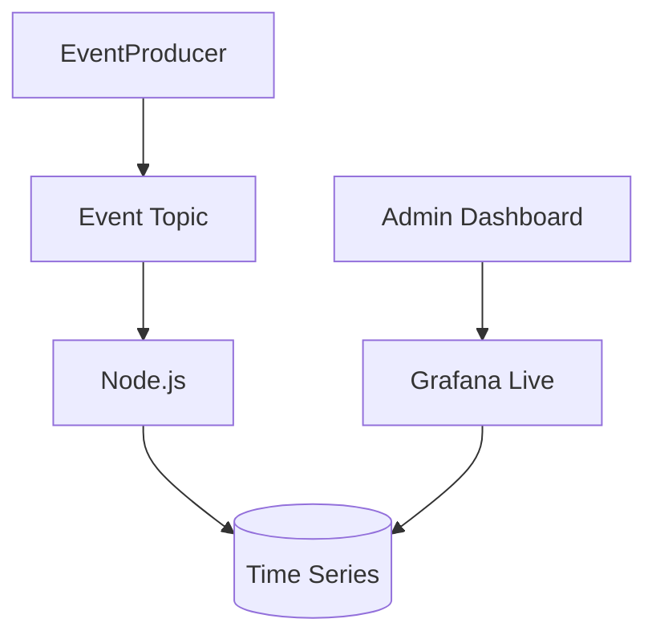

# Echtzeit-Streaming-Dashboard – Architekturdiagramm

```mermaid
flowchart TB
  EventProducer --> Kafka[Event Topic]
  Kafka --> StreamProcessor[Node.js]
  StreamProcessor --> InfluxDB[(Time Series)]
  GrafanaLive[Grafana Live] --> InfluxDB
  UI[Admin Dashboard] --> GrafanaLive
```
