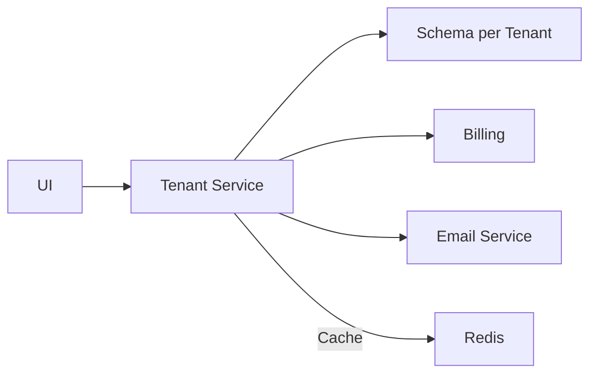

# Multi-Tenant SaaS – Architekturdiagramm

```mermaid
flowchart LR
  UI --> TenantAPI[Tenant Service]
  TenantAPI --> PostgreSQL[Schema per Tenant]
  TenantAPI --> Stripe[Billing]
  TenantAPI --> SMTP[Email Service]
  TenantAPI -->|Cache| Redis
```
