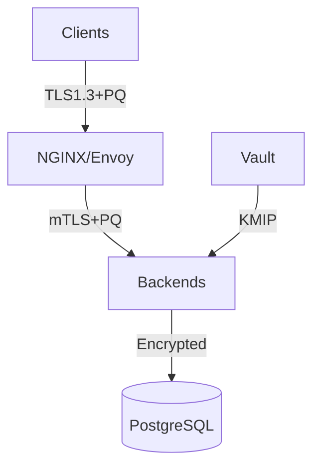

# PQ-Crypto – Architekturdiagramm

```mermaid
flowchart TB
  Clients -->|TLS1.3+PQ| Services[NGINX/Envoy]
  Services -->|mTLS+PQ| Backends
  Backends -->|Encrypted| DB[(PostgreSQL)]
  Vault -->|KMIP| Backends
```
