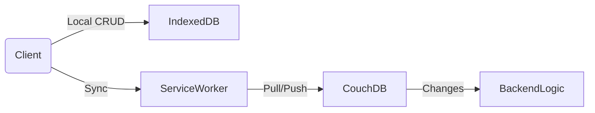

# Offline-First PWA – Architekturdiagramm

```mermaid
flowchart LR
  PWA(Client) -->|Local CRUD| IndexedDB
  PWA -->|Sync| ServiceWorker
  ServiceWorker -->|Pull/Push| CouchDB
  CouchDB -->|Changes| BackendLogic
```
