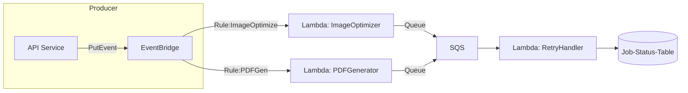

# Serverless Event-Driven Worker Orchestration – Architekturdiagramm

```mermaid
flowchart LR
  subgraph Producer
    A[API Service] -->|PutEvent| EventBridge
  end
  EventBridge -->|Rule:ImageOptimize| Lambda1[Lambda: ImageOptimizer]
  EventBridge -->|Rule:PDFGen| Lambda2[Lambda: PDFGenerator]
  Lambda1 & Lambda2 -->|Queue| SQS
  SQS --> RetryWorker[Lambda: RetryHandler]
  RetryWorker --> DynamoDB[(Job-Status-Table)]
```
